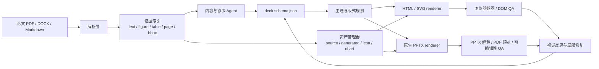

# PPT AI 自动化制作：开源方案、关键技术与 Codex Skill 深度调研

> 调研日期：2026-07-15  
> 目标：为本地 Codex 驱动的“论文/文档 → 精美 HTML 演示 + 原生可编辑 PPTX”产品确定可学习、可复用、可演进的技术栈。  
> 当前工程基线：`deck.schema.json` / 双渲染器 / 本地 Codex / 8–10 页论文结构 / HTML 可视化 / 可编辑 PPTX。

## 0. 结论先行

当前产品不应该直接换成某一个完整的开源项目。更稳妥的路线是：保留现有的 `deck.schema` 和双渲染架构，把成熟项目中的关键思想拆出来，逐步补齐“证据、图片、布局、风格、视觉检查和编辑”六个能力。

### 建议采用的主路线

| 层 | 当前建议 | 主要学习对象 | 采用策略 |
| --- | --- | --- | --- |
| 内容与叙事 | 8–10 页论文结构、每页一个 key message、证据引用 | PPTAgent、PreGenie、当前 `SKILL.md` | 学习其方法，保留自己的 schema |
| PDF/论文解析 | PyMuPDF 起步，Docling/MinerU 作为增强后端 | PyMuPDF、Docling、MinerU、Marker | 先轻后重，统一输出 `evidence index` |
| HTML 渲染 | CSS Grid/Flex + SVG + 少量 Canvas；继续保留现有 HTML renderer | reveal.js、Slidev、Marp、D2、Mermaid | 学习交互与主题体系，不把它们的 PPTX 导出当成可编辑主链 |
| 原生 PPTX | 继续使用现有 renderer；必要时引入 PptxGenJS 或 python-pptx | PptxGenJS、python-pptx、PPTist | 只保留一个主 PPTX 渲染器，避免双引擎漂移 |
| 图表/流程图 | `chart_spec` 用 Vega-Lite；流程图用 Mermaid/D2；图标用 Lucide | Vega-Lite、Mermaid、D2、Lucide | HTML 用 SVG/Canvas，PPTX 映射为原生图表或 SVG/PNG 备份 |
| 图片资产 | 论文原图/截图优先；生成式图片只做背景、插画、装饰 | PyMuPDF、ComfyUI、Diffusers | 事实图不能由扩散模型“猜”出来，所有资产都进入 manifest |
| 风格系统 | 主题 token、风格族、版式族、图片策略、字体策略 | Presenton、PPTist、Marp theme、theme-factory | 学习模板抽取和主题复用，不复制完整产品 |
| Agent 编排 | 先用明确的 Node 状态机；后续再考虑 LangGraph | LangGraph、Ollama、Structured Outputs | 当前不引入过重 Agent 框架 |
| QA | 截图、溢出检查、图片覆盖率、证据可追溯性、PPTX 可编辑性 | DeepPresenter、PPTAgent、PPTEval | 把 `render → inspect → revise` 做成产品闭环 |
| Codex Skill | 当前 `SKILL.md` 作为论文图/方法图结构层；新增项目专属 `ppt-ai-paper` skill | OpenAI skills、Academic PPTX skill、PPTX skill | 把规则、脚本、schema、QA 清单收进 skill |

### 最值得学习的六个项目

1. **Presenton**：研究“参考 PPT/主题 → 可复用设计系统”的产品化路径。
2. **PPTAgent / DeepPresenter**：研究“参考演示分析 + 编辑动作 + 渲染观察 + 反思迭代”的生成闭环。
3. **Docling 或 MinerU**：研究论文的版面、表格、图片、公式和页码证据抽取。
4. **PptxGenJS**：研究 Node/浏览器生态下的原生 PPTX 文本、形状、图表、图片输出。
5. **Mermaid/D2 + Vega-Lite**：研究“声明式图形规格”如何同时服务 HTML 和 PPTX。
6. **OpenAI skills + 当前 `SKILL.md`**：研究如何把内容结构规则、工具调用和质量检查封装成 Codex 可重复执行的工作流。

### 不建议直接作为核心的方案

- **只输出截图的 HTML → PPTX**：视觉可能好看，但文本、形状、图表无法充分编辑。
- **Marp/Slidev 的 PPTX 导出**：非常适合 HTML 演示和快速原型，但官方文档明确提示其 PPTX 导出以图片为主，文本通常不可选。
- **一开始就引入 LangGraph/LlamaIndex**：它们适合复杂的持久化 Agent、RAG 和人工干预流程，但对当前单机 CLI MVP 偏重。
- **把 PPTist 直接嵌入商业产品**：它是很好的 Web 编辑器参考，但 AGPL-3.0 会影响闭源商业集成方式。
- **把 ComfyUI/扩散模型用于数据图和论文事实图**：生成式图片适合氛围和概念插画，不适合作为实验结果、架构细节或数字图表的事实来源。

---

## 1. 评估标准：什么才值得引入

本项目不是单纯的“文生图”，而是同时要求：

1. **内容正确**：论文结论、数字、方法步骤和限制不能被模型自由改写。
2. **结构完整**：8–10 页要能覆盖论文的研究问题、贡献、方法、实验、结果、限制和结论。
3. **视觉有变化**：不能每次都生成相同的深色卡片、相同网格和相同背景。
4. **资产有来源**：论文图、表、截图、图标、生成式资产都能追溯。
5. **HTML 可演示**：支持浏览器、动画、交互、SVG、响应式和截图 QA。
6. **PPTX 可编辑**：标题、正文、形状、表格、图表尽可能是 PowerPoint 原生对象。
7. **本地可运行**：能在 Windows + Codex + 本地 Node/Python 环境中逐步落地。
8. **可复现**：同一输入、主题和随机种子应该能得到可解释的输出，而不是完全不可控的视觉结果。
9. **许可证可接受**：必须区分 MIT/Apache/GPL/AGPL、研究代码和仅供参考的 skill。

因此，“开源”不应只理解为 GitHub 上能看到源码，而要同时检查：源码许可证、模型许可证、生成资产的使用权、PPTX 导出限制和商用边界。

---

## 2. 生态地图



最重要的架构判断是：**LLM 负责“结构与决策”，renderer 负责“确定性表达”，QA 负责“找出可见错误”**。不要让模型每次直接生成一段不可检查的 HTML 或 PPTX XML。

---

## 3. 开源方案全景

### 3.1 AI PPT 生成与编辑框架

| 项目 | 核心能力 | 对本项目的启发 | 适合直接引入吗 |
| --- | --- | --- | --- |
| [Presenton](https://github.com/presenton/presenton) | 自托管 AI PPT 生成；支持多种模型、本地模型、HTML/Tailwind 主题、参考 PPT 主题抽取、可编辑 PPTX、图片 provider、API/MCP | 研究主题复用、参考 PPT 分析、可编辑导出和本地部署的完整产品链 | 适合做竞品/架构参考；可拆组件，但不建议直接替换当前内核 |
| [PPTAgent](https://github.com/icip-cas/PPTAgent) | Agentic PPT 框架；分析参考演示，生成编辑动作，迭代修改；包含模板/自由设计方向 | 生成不是一次性写满页面，而是“草稿 → 编辑动作 → 重新渲染” | 适合学习；直接部署需关注环境、依赖和 Windows 适配 |
| [DeepPresenter](https://arxiv.org/abs/2602.22839) | 将演示生成建模为环境中的观察—反思—修订循环，关注像素级视觉瑕疵和动态布局 | 建立“截图不是最终结果，而是下一轮反思输入”的闭环 | 适合吸收算法思想，不必整体迁移 |
| [PreGenie](https://arxiv.org/abs/2505.21660) | 基于 Slidev 的多模态生成流程；生成代码后做代码审查和页面审查 | 证明“内容审查 + 页面审查”的双审查比只生成一次更可靠 | 适合作为研究实现参考 |
| [DOC2PPT](https://doc2ppt.github.io/) | 从文档读取文本和图片，自动总结、改写并放置到幻灯片 | 论文/报告到大纲和图文布局的基础范式 | 适合做基线和评测对照 |
| [PPTist](https://github.com/pipipi-pikachu/PPTist) | Vue 3/TypeScript 的 Web PPT 编辑器；文本、图片、形状、图表、表格、音视频、主题、PPTX 导入导出 | 可作为浏览器编辑器、AIPPT schema 和画布交互的参考 | 适合做编辑器原型参考；AGPL-3.0，商用集成需谨慎 |

#### 重点学习：PPTAgent 的两阶段思路

PPTAgent 的研究工作把生成拆成两步：先分析参考演示并抽取页面功能类型、内容结构和可复用信息，再根据大纲选择参考页面并生成编辑操作。这个思路对当前项目非常重要：

- `outline` 不再只是一组标题，而要带有 `slide_role`、`claim`、`evidence_refs`、`visual_plan`。
- `layout` 不再由 LLM 直接写死坐标，而是从版式库中选择或生成约束。
- `edit_actions` 可以表示“添加图、替换图、压缩段落、改为两列、移动结果卡片”，便于局部重生成。
- 每页生成后都要有截图和检查结果，失败时只重做失败页，而不是整套 PPT 全部重来。

#### 重点学习：DeepPresenter 的视觉闭环

建议在现有 `qa` 目录增加以下中间状态：

```json
{
  "slide_id": "s06",
  "render_snapshot": "qa/s06.png",
  "observations": [
    {"type": "overflow", "target": "body", "severity": "high"},
    {"type": "low_image_coverage", "severity": "medium"},
    {"type": "weak_hierarchy", "target": "result_card", "severity": "medium"}
  ],
  "revision_actions": [
    {"action": "shorten_text", "target": "body"},
    {"action": "add_source_figure", "target": "s06"}
  ]
}
```

这类结构比让 Codex 重新“凭感觉美化一遍”更容易调试、评测和迭代。

---

### 3.2 原生可编辑 PPTX 生成

| 项目/技术 | 能力 | 编辑性 | 建议 |
| --- | --- | --- | --- |
| [PptxGenJS](https://github.com/gitbrent/PptxGenJS) | Node/浏览器生态；文本、形状、图片、表格、图表、媒体、模板；输出 OOXML PPTX | 原生文本/形状/表格/图表可编辑；复杂 SVG 或整页图片仍是图片对象 | 如果当前 artifact-tool 对图片/图表支持不足，优先作为 Node 主 renderer 候选 |
| [python-pptx](https://python-pptx.readthedocs.io/en/stable/) | Python 创建、读取、更新 PPTX；支持文本、图片、形状、表格、柱线饼图等 | 原生对象可编辑 | 适合做 PDF/PPTX 解析辅助、图表/图片 fallback；不建议与 Node renderer 长期无规则并存 |
| OOXML/PresentationML | 直接操作 `.pptx` 压缩包及 XML；可检查 master、layout、theme、slide、notes、shape、picture、table | 理论上最强 | 适合做深度 QA、模板修复和兼容性分析；不适合 MVP 直接手写全部 XML |
| [LibreOffice UNO](https://api.libreoffice.org/) | Office 文档 API、转换、渲染、自动化 | 视对象类型而定 | 适合作为 Windows/Linux 预览和转换工具，不建议把 UNO 作为核心布局引擎 |

#### 原生可编辑性的分级目标

不要把“PPTX 文件能打开”误当成“PPTX 可编辑”。建议在 QA 中明确分级：

| 等级 | 结果 | 目标 |
| --- | --- | --- |
| L0 | 整页截图 | 仅适合预览，不满足可编辑要求 |
| L1 | 文本框可选，主要视觉元素是图片 | 可改文案，但不能改结构 |
| L2 | 文本、形状、表格、基础图表为原生对象 | MVP 目标 |
| L3 | 图表、流程图、主题、母版、图片裁剪和布局均可编辑 | 中长期目标 |
| L4 | 参考 PPT 导入后保持大部分结构并可局部重生成 | 产品竞争力目标 |

当前项目至少要达到 L2：标题、正文、卡片、箭头、表格和基础图表不能全部扁平化。

#### PptxGenJS 与 python-pptx 的选择

- **Node 主链优先**：如果当前 Codex、schema 和 HTML renderer 都是 JavaScript，PptxGenJS 的集成成本更低。
- **Python 辅助优先**：如果论文解析、图像处理和科学图表大量依赖 Python，python-pptx 可以做独立的辅助 renderer 或兼容性 fallback。
- **不要两者同时成为“最终真相”**：两套 renderer 会产生字体、边距、坐标、图表样式和导出兼容性差异。建议定义一个 `renderer contract`，只有一个默认 PPTX renderer。

---

### 3.3 HTML-first 演示框架

| 项目 | 优势 | 局限 | 在本项目中的位置 |
| --- | --- | --- | --- |
| [reveal.js](https://github.com/hakimel/reveal.js) | HTML 原生演示、嵌套页面、Markdown、动画、演讲者备注、PDF 导出、插件 API | 不负责原生可编辑 PPTX | 适合研究交互演示和 HTML 播放器；不替换当前 schema |
| [Slidev](https://sli.dev/guide/exporting.html) | Markdown + Vue + HTML + UnoCSS；交互、代码、Mermaid、PlantUML、LaTeX、演讲模式 | 官方 PPTX 导出以图片为主，文本不可选 | 适合 HTML 方案和快速视觉原型；不要作为可编辑 PPTX 主链 |
| [Marp](https://marp.app/) | Markdown → HTML/PDF/PPTX/图片；主题和 CSS 体系简单；MIT | PPTX 导出不适合作为强编辑性方案；复杂自由布局受限 | 适合做 Markdown 内容原型、主题验证和 PDF 备份 |
| 当前自研 HTML renderer | 可完全控制 schema、图片、SVG、动画和 QA | 需要自己建设主题、布局和浏览器截图工具 | 应继续作为主 HTML renderer |

#### HTML 与 PPTX 不需要强行使用同一个 DOM

建议共享以下“语义规格”：

```json
{
  "kind": "chart",
  "chart_spec": {"grammar": "vega-lite", "mark": "bar"},
  "semantic_role": "compare_metric",
  "evidence_refs": ["p12-table-2"],
  "fallback": {"type": "svg", "path": "assets/chart-02.svg"}
}
```

然后分开实现：

- HTML：Vega-Lite/ECharts → SVG 或 Canvas，支持 hover、动画和响应式。
- PPTX：映射为原生图表；如果映射失败，再插入 SVG/PNG 并标记为 `editable_level: image`。
- QA：同时检查 HTML DOM 和 PPTX 预览，不能只看其中一个。

---

### 3.4 论文/PDF 解析与证据抽取

| 项目 | 适合做什么 | 优点 | 风险/成本 | 推荐阶段 |
| --- | --- | --- | --- | --- |
| [PyMuPDF](https://pymupdf.readthedocs.io/en/latest/) | 读取页面文本、渲染页面、提取嵌入图片和元数据 | 轻量、速度快、适合本地 Windows；可按 xref 提取原图 | 版面语义、表格结构和阅读顺序能力有限 | 立即采用 |
| [Docling](https://github.com/docling-project/docling) | PDF 版面、阅读顺序、表格、代码、公式、图片分类、统一文档对象 | 输出 Markdown/HTML/JSON；支持本地/离线；适合建立结构化证据 | 依赖和模型更重；需要评估本机资源 | Phase 2 |
| [MinerU](https://github.com/opendatalab/MinerU) | PDF/图片/DOCX/PPTX/XLSX → Markdown/JSON；OCR、公式、表格、图片和版面可视化 | 对论文和复杂 PDF 很强；适合图片/表格/标题抽取；支持 Windows 路线 | 安装、模型和推理成本更高；许可证需逐版本确认 | Phase 2 |
| [Marker](https://github.com/datalab-to/marker) | PDF → Markdown/JSON/chunks/HTML；输出图片链接、表格、LaTeX、结构树 | 输出直接，适合做另一种解析后端和对照实验 | 复杂论文版面仍需要质量评估 | Phase 2/备选 |
| pypdf | 纯文本读取、页码和 metadata | 依赖少，适合快速 fallback | 对图片、表格和复杂版面弱 | 作为 fallback |

#### 统一的 Evidence Index

无论底层使用哪种解析器，都应该转换为统一数据结构：

```json
{
  "document_id": "simplevla-rl",
  "pages": [
    {
      "page": 12,
      "text": "...",
      "blocks": [
        {"id": "p12-b03", "type": "paragraph", "bbox": [72, 184, 512, 298], "text": "..."},
        {"id": "p12-table-2", "type": "table", "bbox": [72, 310, 512, 620], "caption": "..."},
        {"id": "p12-fig-3", "type": "figure", "bbox": [72, 630, 512, 820], "asset": "assets/p12-fig-3.png"}
      ]
    }
  ],
  "claims": [
    {"id": "claim-07", "text": "...", "source_refs": ["p12-table-2", "p13-b01"]}
  ]
}
```

这样可以解决当前“只给 Codex 一段 1353 字总结，所以每次大纲差不多”的根因：模型看到的不只是摘要，而是可检索的全文、页码、图、表、标题、caption 和具体证据。

#### 论文解析的两层策略

**Phase 1：快速本地模式**

```text
pypdf/PyMuPDF
  → page_text.json
  → embedded_images/
  → page_screenshots/
  → evidence-index.json
```

**Phase 2：高质量结构模式**

```text
Docling 或 MinerU
  → layout-aware JSON
  → figure/table/formula/heading blocks
  → evidence-index.json
```

模型只读取与当前页面有关的证据切片，而不是把全部 PDF 一次塞进上下文。这样既降低 token 成本，也能减少模型遗漏后半部分内容的问题。

---

### 3.5 图表、流程图、图标与矢量资产

| 技术 | 适合表达 | HTML | PPTX | 推荐 |
| --- | --- | --- | --- | --- |
| [Mermaid](https://github.com/mermaid-js/mermaid) | 流程图、时序图、类图、状态图、ER、甘特、思维导图、时间线 | SVG/HTML 很方便 | 通常作为 SVG/PNG，复杂图不一定原生可编辑 | 论文方法流程的默认候选 |
| [D2](https://github.com/terrastruct/d2) | 更强调布局、连接线和视觉风格的声明式图 | SVG/PNG/PDF | 支持导出 PPTX，需验证编辑性和兼容性 | 复杂方法图、系统架构图候选 |
| [Vega-Lite](https://vega.github.io/vega-lite/docs/) | 条形图、折线图、散点图、分层、分面、组合图 | SVG/Canvas、可交互 | 可映射到原生图表或插入 SVG | 统一 `chart_spec` 的首选 |
| [Apache ECharts](https://echarts.apache.org/) | 浏览器交互图表、复杂数据图、动画 | Canvas/SVG | 导出为 SVG/PNG，原生 PPTX 需另行映射 | HTML 图表增强 |
| [Lucide](https://github.com/lucide-icons/lucide) | 统一线性图标、功能图标、轻量 pictogram | SVG | SVG/PNG 或映射为形状 | 建立图标风格库 |

#### 选择原则

- **流程和因果关系**：优先 Mermaid/D2 的文本规格，不让 LLM 直接写坐标。
- **真实数据**：优先 Vega-Lite/ECharts，数字和数据绑定必须来自证据索引。
- **装饰图标**：使用 Lucide 或项目自己的 icon set，禁止随机混用 emoji、不同线宽的图标和不一致的插画。
- **PPTX 原生编辑**：简单柱状图、折线图、表格应映射到原生 PowerPoint 对象；复杂关系图可以保留 SVG，但在 schema 中明确 `editable_level`。

---

### 3.6 本地图片生成与资产管理

| 项目 | 用途 | 使用边界 |
| --- | --- | --- |
| [ComfyUI](https://github.com/Comfy-Org/ComfyUI) | 节点式扩散模型工作流；本地 API；工作流 JSON 可复现；可用于图片、视频、3D、音频 | 适合背景、概念插画、抽象纹理、封面视觉；不适合事实图、数据图和论文方法细节 |
| [Hugging Face Diffusers](https://huggingface.co/docs/diffusers/api/pipelines/overview) | Python 中直接调用 text-to-image、image-to-image、inpainting 等 pipeline | 适合接入自动化资产服务；必须记录模型、版本、seed、prompt 和许可证 |
| Stable Diffusion 系列 | 生成式图片模型生态 | 具体模型许可证不同，不能笼统宣称所有模型都可商用 |

建议将资产分成四类：

```text
evidence_asset  论文中提取的真实图、表、截图
generated_asset  生成式背景、插画、封面视觉
diagram_asset    Mermaid/D2/SVG 流程图
chart_asset      Vega-Lite/ECharts 或原生 PPTX 图表
```

资产 manifest 至少记录：`asset_id`、`type`、`source_page`、`source_bbox`、`path`、`caption`、`license`、`model`、`seed`、`prompt`、`editable_level`。这样既可以排查“为什么没有图片”，也可以避免图片来源不清楚。

---

### 3.7 LLM、结构化输出与 Agent 编排

| 技术 | 价值 | 当前建议 |
| --- | --- | --- |
| [OpenAI Structured Outputs](https://openai.com/index/introducing-structured-outputs-in-the-api/) | 让模型按 JSON Schema 输出，减少大纲和 deck schema 的格式错误 | 继续使用，但保持 schema 平坦、少用复杂 `oneOf`/`anyOf`，兼容当前 Codex 输出限制 |
| [Ollama](https://ollama.readthedocs.io/en/api/) | 本地模型 API、embedding、JSON Schema structured outputs | 作为无网络/低成本模式；用于大纲、分类、摘要和简单修复，不要求本地小模型独立完成全套视觉设计 |
| [LangGraph](https://docs.langchain.com/oss/python/langgraph/persistence) | 持久化状态、checkpoint、人工干预、恢复、时间旅行调试 | 当产品支持长任务、人工审稿、局部重生成后再引入 |
| [LlamaIndex](https://docs.llamaindex.ai/) | 文档连接器、索引、RAG、Agent、评估和可观测性 | 当证据库从单篇 PDF 扩展到多文档知识库时再考虑 |

#### 当前不要追求“全自动 Agent”

当前更适合显式状态机：

```text
parse → index → outline → story_check → visual_plan → render_html
      → render_pptx → qa → revise_failed_slides → export
```

每一步都写中间文件，便于 Codex 检查和用户手动修改。等这些状态稳定后，再把状态机升级为 LangGraph 或其他工作流编排框架。

---

## 4. Codex Skill：哪些能直接学习和利用

### 4.1 当前项目 `SKILL.md` 的价值

项目根目录的 [`SKILL.md`](./SKILL.md) 实际上是一个“科研图结构层 skill”，不是完整 PPT 设计模板。它最适合解决以下问题：

- 从论文抽取唯一 `key_message`。
- 判断图/页的关系类型：`sequence`、`comparison`、`feedback`、`overview`、`matrix`、`mechanism` 等。
- 规定阅读顺序、分组、层级、箭头语义和文字角色。
- 把结构输出为 machine-readable schema，而不是泛泛地说“做得简洁、专业”。
- 用 checklist 进行 `pass / revise / reject` 审查。
- 强调图形摘要、方法图和机制图的可读性、颜色非唯一编码、箭头语义和缩小后阅读能力。

它能直接改善当前 PPT 产品的“内容结构重复”和“论文图不知如何表达”问题，但不能单独解决：

- 多主题、多风格和背景变化。
- 精细的 PPTX 坐标、字体和母版。
- 图片搜索、图片生成和版权记录。
- 浏览器截图、溢出检测和 PPTX 解包检查。

因此，建议把它放在 `structure_planner` 阶段，而不是当作 renderer skill。

### 4.2 建议组合的 Skill

| Skill | 作用 | 与当前工程的关系 |
| --- | --- | --- |
| 当前项目 `scientific-figure-structure` | 论文图/方法图/机制图的结构分析 | 直接保留并接入 `visual_plan` |
| 本地 presentations skill | PPTX 工作流、布局、渲染和检查 | 作为技术层参考，补充原生 PPTX QA |
| `academic-figure-prompt` | 科研图和图形摘要的视觉提示词 | 用于生成非事实型插画和图形资产，不替代结构 schema |
| `pdf` skill | PDF 读取、页面检查和内容处理 | 与 PyMuPDF/Docling/MinerU 结合 |
| `playwright` skill | 浏览器自动化、截图和页面 QA | 用于 HTML 逐页截图和 DOM 检查 |
| `canvas-design` / `theme-factory` 类 skill | 主题、版式和视觉风格 | 用于风格层，避免所有页面使用同一套卡片布局 |
| [OpenAI skills](https://github.com/openai/skills) | 研究 SKILL.md 的目录、脚本、资源组织方式 | 可用于发布项目专属 skill |
| [Academic PPTX skill](https://github.com/Gabberflast/academic-pptx-skill) | action title、论证结构、图表纪律、引用规范 | 适合学习“论文内容如何变成讲稿结构”；需检查版本许可证 |
| [Anthropic PPTX skill](https://github.com/anthropics/skills/blob/main/skills/pptx/SKILL.md) | PPTX 读取、解包、缩略图、PptxGenJS、模板分析和 QA 工作流 | 适合作为技术流程参考；仓库页面注明其许可证限制，不应未经审查复制到商业产品 |
| MiniMax `pptx-generator` skill | PptxGenJS、主题对象、图片目录和 QA | 适合学习工程组织方式，需检查许可证和代码质量 |

### 4.3 建议新增项目专属 Skill：`ppt-ai-paper`

建议在项目中新增一个独立 skill，负责把上述规则串成 Codex 可执行流程：

```text
ppt-ai-paper/
├── SKILL.md
├── schemas/
│   ├── evidence-index.schema.json
│   ├── deck.schema.json
│   └── qa-report.schema.json
├── scripts/
│   ├── extract-paper.mjs
│   ├── build-evidence-index.mjs
│   ├── render-all.mjs
│   ├── inspect-slides.mjs
│   └── make-contact-sheet.mjs
├── references/
│   ├── paper-8-10-slide-outline.md
│   ├── layout-selection.md
│   ├── image-policy.md
│   └── pptx-editability.md
└── assets/
    ├── icons/
    ├── theme-presets/
    └── sample-decks/
```

Skill 的 `SKILL.md` 要明确：

1. 何时触发：输入是论文 PDF、论文 Markdown、实验报告或用户要求制作学术 PPT。
2. 先运行什么：解析、建立证据索引、提取论文结构。
3. 必须输出什么：大纲、页级 claim、证据引用、视觉计划、资产 manifest、QA 报告。
4. 不能做什么：不得凭空生成实验数字、不得将生成式插画伪装成论文事实图、不得把所有页面套同一版式。
5. 失败如何修：按 `review_flags` 进行局部修复，而不是直接重新生成整套 PPT。

---

## 5. 推荐的统一数据模型

当前 `deck.schema.json` 建议补充以下四个对象：

### 5.1 主题层

```json
{
  "theme": {
    "style_id": "academic-editorial-01",
    "family": "light-editorial",
    "tokens": {
      "background": "#F7F8FA",
      "surface": "#FFFFFF",
      "text": "#18212B",
      "muted": "#68727D",
      "accent": "#1677FF",
      "success": "#1B9A59",
      "warning": "#D99000",
      "danger": "#C74343"
    },
    "typography": {"title": "Aptos Display", "body": "Aptos"},
    "image_policy": "source-figure-first",
    "layout_family": "editorial-grid"
  }
}
```

### 5.2 证据引用层

```json
{
  "evidence_refs": [
    {
      "id": "p12-table-2",
      "source_page": 12,
      "source_type": "table",
      "asset_ref": "asset-table-02",
      "claim_ids": ["claim-07"],
      "citation_text": "Table 2"
    }
  ]
}
```

### 5.3 页面规划层

```json
{
  "slides": [
    {
      "id": "s06",
      "role": "results",
      "title": "强化学习让 VLA 从收集示范转向使用环境反馈",
      "action_title": true,
      "claim": "主要结果句，而不是章节名",
      "evidence_refs": ["p12-table-2", "p13-fig-3"],
      "layout": "result-hero-with-chart",
      "visual_plan": {
        "primary": "chart",
        "secondary": "source_figure_crop",
        "decorative": "none"
      },
      "elements": []
    }
  ]
}
```

### 5.4 资产层

```json
{
  "assets": [
    {
      "id": "asset-fig-03",
      "type": "evidence_asset",
      "path": "assets/p13-fig-3.png",
      "source_page": 13,
      "caption": "Training performance comparison",
      "license": "source-paper",
      "editable_level": "image",
      "alt_text": "..."
    }
  ]
}
```

### 5.5 页面角色与版式不要一一绑定

`role = results` 不应该强制等于某个固定模板。应分成两步：

```text
内容角色：results
   ↓
视觉意图：comparison / trend / one-number / source-figure
   ↓
版式族：chart-left / chart-right / hero-metric / two-column
   ↓
主题样式：light-editorial / dark-cinematic / scientific-blue / paper-white
```

这样同一篇论文的结果页可以有不同构图，而不是每次都出现相同背景和相同卡片。

---

## 6. 如何解决“每次风格一样、没有图片”的产品问题

### 6.1 把风格拆成四个可控维度

不要只放一个 `theme = modern`。建议每次生成时显式采样或指定：

| 维度 | 示例 |
| --- | --- |
| `style_family` | light editorial / dark cinematic / Swiss grid / scientific paper / soft gradient / monochrome ink |
| `layout_family` | asymmetric editorial / modular grid / full-bleed image / split-screen / timeline / comparison matrix |
| `image_policy` | source-figure-first / illustration-first / diagram-first / chart-first / text-led |
| `density_profile` | minimal / balanced / information-rich |

同一篇论文固定 `style_family`，但允许每页在 `layout_family` 内使用不同的版式变体；否则每页会显得像复制粘贴。

### 6.2 图片决策必须是结构字段，不是渲染器猜测

每页生成前先决定：

```text
visual_intent =
  source_figure       论文原图/截图
  source_table        论文表格或结构化表格
  data_chart          从论文数字重绘图表
  method_diagram      Mermaid/D2/原生形状
  concept_illustration  生成式概念插画
  decorative_none     无图片，仅当内容确实适合纯文本
```

然后设最低规则：

- 8–10 页中至少 4 页有事实资产、图表或方法图。
- 结果页优先使用论文原图或重绘图表。
- 方法页优先使用流程图/架构图，而不是文字列表。
- 封面、转场页可以使用生成式背景，但必须与论文主题关联。
- 纯文本页必须解释为什么不需要图，而不是默认为无图。

### 6.3 事实图和生成图分开

- 论文图、表、数字、实验曲线：来自 PDF/证据索引。
- 概念插画、背景纹理、封面视觉：可来自 ComfyUI/Diffusers。
- 结构关系图：由 Mermaid/D2/HTML SVG 生成。
- 数据图：由 Vega-Lite/ECharts/原生 PPTX 图表生成。

这是解决“PPT 有图片但不可信”和“PPT 没有图片”的关键边界。

---

## 7. 8–10 页论文 PPT 的推荐生成流程

### 7.1 结构模板

```text
S01  标题与一句话结论
S02  研究问题：为什么这个问题重要
S03  背景/现有方法：缺口是什么
S04  核心贡献：本文到底新增了什么
S05  方法总览：输入 → 关键机制 → 输出
S06  模型/算法/系统细节：只保留理解结果必需的部分
S07  实验设置：数据、基线、指标、环境
S08  主要结果：主图/主表/关键数字
S09  分析：消融、对比、案例、失败模式
S10  限制与结论：能得出什么，不能得出什么
```

页数可按论文内容压缩，但不能把 `S05–S09` 全部合并成“方法与结果”一页。当前测试中 PPT 总是类似，核心原因不是模型不够强，而是页面角色过少、每页没有独立证据和视觉任务。

### 7.2 每页生成协议

每页至少需要：

```text
slide_role
action_title
one_sentence_claim
evidence_refs
visual_intent
layout_variant
image_or_diagram_plan
speaker_note
qa_targets
```

如果某页没有 `evidence_refs`，允许它是引入/转场页，但不能把所有正文页都当成无证据的概念页。

---

## 8. 建议的落地路线

### Phase 1：把现有 MVP 从“固定模板”升级为“主题 + 版式族 + 图片字段”

目标：不引入重型外部框架，先解决当前最直观的问题。

开发内容：

1. 扩展 schema：`theme.style_id`、`layout_family`、`visual_intent`、`assets`、`evidence_refs`、`qa_targets`。
2. 新增 5–6 个主题族，每个主题至少 4 个版式变体。
3. 新增图片元素：`image`、`source_figure`、`figure_crop`、`background_image`。
4. 用 PyMuPDF 提取 PDF 嵌入图片和页面截图。
5. 用 Mermaid 或 D2 生成方法流程图。
6. 用 Lucide 建立统一图标集。
7. HTML 与 PPTX 同时渲染图片、图表和 SVG。
8. 加入图片覆盖率和重复版式检测。

验收标准：

- 同一篇论文至少能稳定生成 3 种视觉风格。
- 8–10 页中至少 4 页包含事实资产、图表或方法图。
- PPTX 标题、正文、形状、表格和基础图表达到 L2 编辑性。
- `deck.schema.json` 能记录每个图和数字的来源页码。

### Phase 2：论文全文与证据索引

目标：解决“只读摘要/总结，所以大纲重复”的根因。

开发内容：

1. `extract-paper` 支持 PDF → 页级文本、图片、表格、caption、标题。
2. 首先实现 PyMuPDF/pypdf 双后端。
3. 增加 Docling 或 MinerU 的可选 parser adapter。
4. 构建 `evidence-index.json`。
5. 将全文按章节、页、证据块切片后再提供给 Codex。
6. 让 Codex 输出 8–10 页大纲，并要求每页绑定 `evidence_refs`。
7. 增加“论文事实校验”：页面数字必须来自证据片段，不允许模型自行编造。

验收标准：

- 大纲覆盖摘要、引言、方法、实验、结果、限制/结论，而不是只覆盖摘要。
- 每张主图、主表和关键数字都有来源页码。
- 论文后半部分的结果、消融和限制能稳定进入 deck。

### Phase 3：视觉质量闭环

目标：从“生成一版”变成“生成—观察—修正”。

开发内容：

1. HTML 逐页截图和 DOM overflow 检查。
2. PPTX 转 PDF/图片后做 contact sheet。
3. 检查：溢出、遮挡、过小字体、重复版式、无图片、低对比度、引用缺失。
4. 为每个问题生成 `review_flags` 和 `revision_actions`。
5. 只重生成失败页。
6. 对比两轮截图，避免“修了一个问题又破坏另一个页面”。

可借鉴 PPTAgent/DeepPresenter 的 Content、Design、Coherence 三个评估维度：

- **Content**：是否正确、完整、可追溯。
- **Design**：是否有层次、对齐、留白、视觉变化和图文平衡。
- **Coherence**：整套 deck 是否有叙事推进，是否前后术语、颜色和视觉编码一致。

### Phase 4：参考 PPT 和 Web 编辑器

目标：让用户可以提供一个参考 PPT/主题，自动获得相近但不机械复制的风格，并能在浏览器中局部修改。

开发内容：

1. 解析参考 PPT 的主题、字体、颜色、母版、版式和图片策略。
2. 把分析结果转换成 `theme tokens + layout family`，不直接复制所有坐标。
3. 研究 Presenton 的模板/主题工作流。
4. 研究 PPTist 的 Web 画布、图层和 AIPPT schema；若商用，提前做 AGPL 隔离或只学习交互。
5. 增加“重新生成本页”“替换主图”“改为深色主题”“压缩文字”等页面级操作。

### Phase 5：复杂 Agent 和协作

只有当以下需求出现时，再引入 LangGraph/LlamaIndex 或服务化任务队列：

- 用户可以暂停、审核、恢复长时间生成任务。
- 多人协作和版本回退成为核心功能。
- 需要跨多篇论文做检索、引用和知识库问答。
- 需要追踪每一步模型调用、成本、评测和人工修改。

---

## 9. 开源方案的取舍矩阵

| 方案 | 研究价值 | 集成价值 | Windows 本地适配 | PPTX 编辑性 | 主要风险 | 结论 |
| --- | ---: | ---: | ---: | ---: | --- | --- |
| Presenton | 高 | 中 | 高 | 高 | 栈较重、需评估许可证与二次集成 | 学产品化，不替换内核 |
| PPTAgent | 很高 | 中 | 中 | 中/高 | 依赖和运行环境复杂 | 学迭代生成和参考页编辑 |
| DeepPresenter | 很高 | 低/中 | 待评估 | 取决于 renderer | 研究代码成熟度 | 学视觉反思闭环 |
| PPTist | 高 | 中/高 | 高 | 高 | AGPL-3.0 | 研究 Web 编辑器，商用谨慎 |
| PptxGenJS | 高 | 高 | 高 | 高 | 复杂图形需做兼容性 QA | Node PPTX 主 renderer 候选 |
| python-pptx | 高 | 中 | 高 | 高 | 与 Node renderer 风格分叉 | Python 辅助/备用 renderer |
| Marp | 中 | 高 | 高 | 低/中 | PPTX 可能扁平化 | HTML/PDF 原型，不做可编辑主链 |
| Slidev | 高 | 中 | 高 | 低 | PPTX 文本不可选 | HTML 交互参考 |
| reveal.js | 高 | 中 | 高 | 无原生导出 | 需要自建 PPTX renderer | HTML 演示参考 |
| Docling | 很高 | 高 | 中 | 不适用 | 依赖/模型重 | Phase 2 解析后端 |
| MinerU | 很高 | 高 | 中/高 | 不适用 | 安装和许可证需核查 | 论文解析增强后端 |
| PyMuPDF | 高 | 高 | 高 | 不适用 | 结构语义有限 | Phase 1 立即使用 |
| Mermaid | 高 | 高 | 高 | 中 | 复杂图可能不可编辑 | 流程图默认候选 |
| D2 | 高 | 中 | 高 | 中 | PPTX 编辑性需验证 | 复杂图候选 |
| Vega-Lite | 高 | 高 | 高 | 中/高 | PPTX 原生映射需开发 | 图表 schema 首选 |
| ECharts | 高 | 高 | 高 | 中 | 需导出 SVG/PNG | HTML 交互图表 |
| ComfyUI | 中/高 | 中 | 中 | 不适用 | 模型和许可证复杂 | 非事实视觉资产 |
| Ollama | 高 | 高 | 高 | 不适用 | 本地模型质量不稳定 | 本地模型通道 |
| LangGraph | 高 | 低/中 | 高 | 不适用 | 对 MVP 过重 | 后期引入 |

---

## 10. 许可证与工程风险清单

在把外部项目直接放进产品前，必须逐项确认：

1. **代码许可证**：MIT/Apache 通常更容易集成；GPL/AGPL 需要理解衍生作品和网络服务边界。
2. **模型许可证**：ComfyUI/Diffusers 是框架，不代表具体模型的权利相同。
3. **字体许可证**：PPTX 在用户机器上打开时可能缺字或替换字体，建议内置字体 fallback 和字体检查。
4. **图片许可证**：Pexels、Pixabay、论文原图、用户上传图片和模型生成图片需要分别记录来源。
5. **研究代码状态**：论文代码可能只适合实验，未必有 Windows 安装、版本锁定或商业支持。
6. **AGPL 编辑器**：PPTist 可学习其设计，但将其源码或核心组件直接集成到闭源产品前应先做法律评估。
7. **第三方 API**：Presenton 支持多种模型 provider，但本项目若坚持本地 Codex，需要把 provider 层做成可替换接口。

建议在项目中增加：

```text
NOTICE.md
licenses/
  third-party-code.md
  third-party-models.md
  fonts.md
  image-sources.md
```

---

## 11. 最小可行的技术栈建议

### 保守版：适合现在马上开发

```text
Codex/local model
  + current scientific-figure-structure SKILL
  + pypdf/PyMuPDF
  + evidence-index.json
  + current deck.schema.json
  + CSS Grid/Flex + SVG
  + Mermaid
  + Lucide
  + current PPTX renderer or PptxGenJS
  + Playwright screenshot QA
```

### 增强版：适合 Phase 2

```text
Docling or MinerU
  + figure/table/caption extraction
  + Vega-Lite chart spec
  + D2 complex diagram
  + theme/layout registry
  + source asset manifest
  + render-observe-revise loop
```

### 产品化版：适合后期

```text
reference PPT style extraction
  + page-level regeneration
  + PPTist-like browser editor
  + LangGraph durable workflow
  + multi-document evidence RAG
  + evaluation dashboard
```

---

## 12. 推荐学习顺序

### 第一阶段：先把当前产品做对

1. 阅读当前项目 `SKILL.md`，把结构层规则映射到 slide schema。
2. 阅读 PptxGenJS 的文本、图片、表格、图表和模板 API。
3. 阅读 PyMuPDF 的页面渲染和图片提取 API。
4. 做一个 `paper → evidence-index.json → 8–10 页 outline` 的可复现实验。
5. 为每页加 `visual_intent`，先解决无图和同模板问题。

### 第二阶段：提高论文理解能力

1. 对比 PyMuPDF、Marker、MinerU、Docling 在同一篇论文上的输出。
2. 把 figure/table/caption/section/title 变成统一证据对象。
3. 用证据引用驱动标题、图表和讲稿，而不是只把全文交给模型。

### 第三阶段：提高视觉质量

1. 阅读 PPTAgent 的论文和代码，理解参考页、编辑动作和内容/设计/连贯性评测。
2. 阅读 DeepPresenter，设计截图观察与局部修复。
3. 用 Mermaid/D2/Vega-Lite 建立声明式图形组件库。
4. 引入 6 个主题族和 20 个版式变体，做视觉回归测试。

### 第四阶段：做编辑和产品化

1. 研究 Presenton 的主题复用、参考 PPT 和本地 provider。
2. 研究 PPTist 的画布、图层、主题和页面编辑交互。
3. 根据商业许可证和工程边界决定自研、借鉴还是隔离集成。

---

## 13. 评测指标

建议为产品建立一个固定测试集，不再只用一篇论文目测结果：

| 指标 | 测量方式 | MVP 目标 |
| --- | --- | --- |
| 大纲覆盖率 | 论文章节/关键结论进入页面的比例 | ≥ 90% |
| 证据可追溯率 | 页面 claim 能回指页码/图/表的比例 | 100% 的事实型页面 |
| 事实资产覆盖率 | 有论文图、表、重绘图或方法图的页面比例 | 8–10 页中 ≥ 4 页 |
| 风格多样性 | 同一论文用不同 style/layout 生成的视觉差异 | ≥ 3 个风格族 |
| 版式重复率 | 相邻页使用同一 layout 的比例 | 不超过 2 页连续重复 |
| 溢出率 | 标题、正文、图表越界页面比例 | 0 |
| PPTX 编辑性 | 原生文本/形状/表格/图表对象占比 | 至少达到 L2 |
| HTML/PPTX 内容一致性 | 标题、数字、图表和引用对比 | 100% 关键字段一致 |
| 视觉审查通过率 | 人工或评测者对 Content/Design/Coherence 的评分 | 逐版本提高 |

可以借鉴 PPTAgent 的 Content/Design/Coherence 三维评价，也可以参考 [PPT-Eval](https://arxiv.org/abs/2606.31154) 的任务式评估思路，建立“内容正确、布局合适、元素可操作、风格一致、导出成功”的可重复测试集。

---

## 14. 最终推荐清单

### 现在就学、现在就用

- 当前项目的 `SKILL.md`：科研图结构层。
- PyMuPDF：页面渲染和图片提取。
- PptxGenJS：Node 原生 PPTX 输出候选。
- Mermaid：方法流程和关系图。
- Vega-Lite：统一图表 schema。
- Lucide：统一图标资源。
- OpenAI skills 的 SKILL.md 组织方式。
- Playwright：HTML 截图与自动化 QA。

### 现在重点学习，但分阶段集成

- PPTAgent：参考页分析、编辑动作、内容/设计/连贯性评测。
- DeepPresenter：渲染观察和视觉反思。
- Presenton：主题抽取、参考 PPT 复用、可编辑导出和 provider 架构。
- Docling 或 MinerU：复杂论文版面和证据索引。
- D2：更复杂的流程图、架构图和关系图。
- PPTist：Web 编辑器交互和 AIPPT 数据组织，但要隔离 AGPL 风险。

### 暂缓

- LangGraph：等出现长任务、人工审核、断点恢复。
- LlamaIndex：等出现多文档知识库和复杂 RAG。
- ComfyUI/Diffusers：先解决论文事实图，再做生成式视觉资产。
- Slidev/Marp：用作 HTML/Markdown 演示参考，不用作可编辑 PPTX 主链。

---

## 15. 关键参考资料

### AI PPT 与研究方法

- [PPTAgent GitHub](https://github.com/icip-cas/PPTAgent)
- [PPTAgent: Generating Editable Slides with Text-to-Image Models](https://aclanthology.org/2025.emnlp-main.728/)
- [DeepPresenter: A Multi-Agent Framework for Generating Presentations](https://arxiv.org/abs/2602.22839)
- [PreGenie](https://arxiv.org/abs/2505.21660)
- [Presenton GitHub](https://github.com/presenton/presenton)
- [PPTist GitHub](https://github.com/pipipi-pikachu/PPTist)

### PPTX、HTML 与图形

- [PptxGenJS](https://github.com/gitbrent/PptxGenJS)
- [python-pptx documentation](https://python-pptx.readthedocs.io/en/stable/)
- [reveal.js](https://github.com/hakimel/reveal.js)
- [Slidev export](https://sli.dev/guide/exporting.html)
- [Marp](https://marp.app/)
- [Mermaid](https://github.com/mermaid-js/mermaid)
- [D2](https://github.com/terrastruct/d2)
- [Vega-Lite](https://vega.github.io/vega-lite/docs/)
- [Apache ECharts](https://echarts.apache.org/)
- [Lucide](https://github.com/lucide-icons/lucide)

### 论文解析与资产

- [PyMuPDF](https://pymupdf.readthedocs.io/en/latest/)
- [Docling](https://github.com/docling-project/docling)
- [MinerU](https://github.com/opendatalab/MinerU)
- [Marker](https://github.com/datalab-to/marker)
- [ComfyUI](https://github.com/Comfy-Org/ComfyUI)
- [Diffusers](https://huggingface.co/docs/diffusers/api/pipelines/overview)

### Codex Skill 与编排

- [OpenAI Skills](https://github.com/openai/skills)
- [OpenAI Structured Outputs](https://openai.com/index/introducing-structured-outputs-in-the-api/)
- [Ollama API](https://ollama.readthedocs.io/en/api/)
- [LangGraph persistence](https://docs.langchain.com/oss/python/langgraph/persistence)
- [Academic PPTX Skill](https://github.com/Gabberflast/academic-pptx-skill)
- [Anthropic PPTX Skill reference](https://github.com/anthropics/skills/blob/main/skills/pptx/SKILL.md)

---

## 最终判断

对当前产品最有价值的不是“再找一个更强的 PPT 生成器”，而是建立一条可验证的生产链：

```text
全文解析
  → 页码级证据索引
  → 8–10 页叙事结构
  → 每页视觉意图与资产计划
  → 主题/版式变体
  → HTML + 原生 PPTX 双渲染
  → 截图/溢出/编辑性/证据 QA
  → 失败页局部修复
```

如果只能先做三件事，优先级是：

1. **接入 PyMuPDF 并建立 evidence index**，真正读取论文全文和图片。
2. **把主题、版式和图片策略从 renderer 中抽成 schema**，解决风格单一和无图。
3. **实现 render → inspect → revise**，让 Codex 能根据截图和 QA 结果改页，而不是每次重新生成同一套 PPT。

