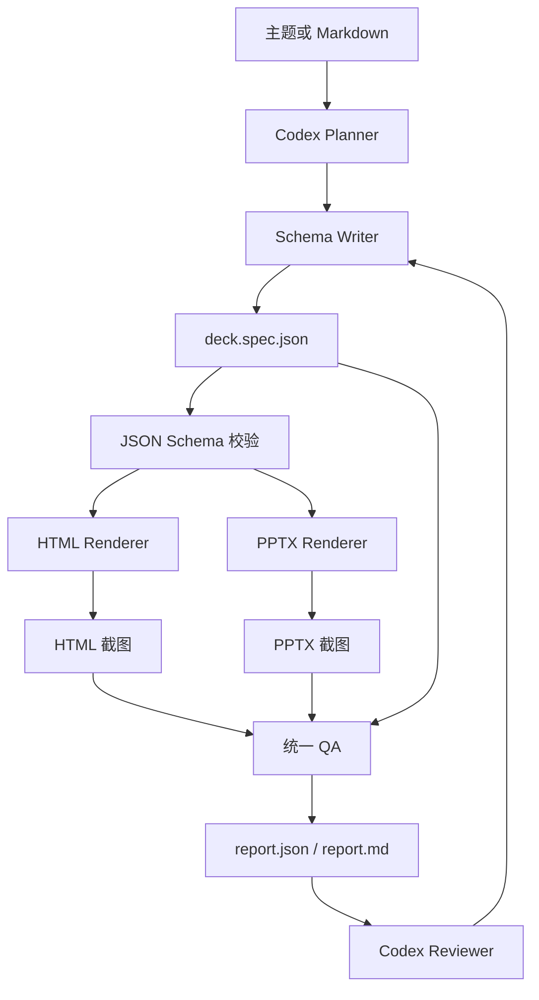

# 基于 Codex 的 PPT 双渲染 MVP 开发文档

## 1. 文档目的

本文档把《PPT双渲染MVP需求文档.md》转换为可执行的本地开发方案，说明目录结构、模块职责、数据契约、实现顺序、测试方法和完成标准。

本项目的核心工程原则是：

> 内容和视觉结构只定义一次；HTML 和 PPTX 各自负责适合自己的输出实现；所有输出都必须可验证、可定位、可复现。

## 1.1 当前实现状态

本目录已经完成 MVP-1 的本地实现：

- `src/codex-bridge.mjs` 优先调用项目内 `@openai/codex` CLI，并使用 JSON Schema 约束 planner/reviewer 输出。
- Codex planner/reviewer 会读取当前目录 `SKILL.md`，提取 review checklist、pipeline 和 comparison 规则，注入提示词。
- `src/cli.mjs` 默认使用 `local-codex`；`--planner deterministic` 保留离线回退，便于渲染和 QA 回归。
- `npm run generate` 的目标链路为：Codex → `deck.spec.json` → HTML/PPTX → QA → Codex review。
- 已验证确定性回退模式可生成 4 页 HTML 与原生可编辑 PPTX，Schema、QA 和 PPTX 溢出检查均通过。

首次使用本地 Codex 前执行 `npx codex login`。若未登录，桥接器会明确返回认证提示，不会静默伪造 AI 结果。

## 2. 技术决策

### 2.1 总体架构



### 2.2 技术选型

| 层 | MVP 选型 | 说明 |
|---|---|---|
| 运行时 | Node.js + ES Modules | 本地 Codex 任务和两个渲染器共享运行时 |
| 结构规格 | JSON + JSON Schema | `deck.spec.json` 是具体演示稿，`deck.schema.json` 是校验契约 |
| HTML | 原生 DOM、CSS、SVG | 16:9 固定画布，便于浏览器呈现和截图 |
| PPTX 主渲染 | `@oai/artifact-tool` | 按本地 Presentations skill 的要求使用 JavaScript ES modules；优先生成原生可编辑对象 |
| PPTX 备用渲染 | PptxGenJS | 当 artifact-tool 不覆盖某个对象类型时，作为明确的 fallback |
| 截图 | 浏览器 + LibreOffice/兼容工具链 | HTML 直接截图，PPTX 先转图再截图或渲染 |
| 质量检查 | 自定义几何/结构规则 + 图像检查 | 先保证可确定的规则，再逐步加入视觉回归 |
| AI 编排 | Codex planner / schema-writer / reviewer | MVP 不绑定特定云端 API；AI 输出必须落盘为可人工修改的 JSON |

### 2.3 不采用的主路径

- 不使用 Python `python-pptx` 作为主实现；本地 Presentations skill 要求 PPTX 生成使用 `@oai/artifact-tool`，并在 JavaScript ES module 环境中运行。
- 不把任意 HTML/CSS 直接当作 PPTX 的可靠转换层。
- `dom-to-pptx` 和 `html2pptx` 仅作为受限 CSS 子集的实验适配器，不能改变双渲染主架构。
- Presenton、PPTAgent、PPT Master、PPTist 作为参考实现和后续集成候选，不作为 MVP 的强依赖。

## 3. 开发前置条件

### 3.1 环境

需要在当前工作区确认以下能力：

- Node.js 可执行，支持 ES Modules。
- 包管理器可用，例如 `npm` 或 `pnpm`。
- 浏览器可用于 HTML 截图。
- LibreOffice 或等价工具可用于 PPTX 转 PDF/图片的自动检查；如果当前环境没有，应在预检阶段明确报告。
- 目标字体已安装，或主题中配置了稳定的字体回退栈。

### 3.2 Presentations skill 约束

开发 PPTX 渲染器前，应先按照本地 Presentations skill 完成 workspace 初始化和依赖加载。实现时遵循这些硬约束：

- 使用 `@oai/artifact-tool` 的 JavaScript 接口。
- 每次生成后渲染每一页并进行全尺寸检查。
- 连接线、箭头和背景装饰先绘制，再绘制节点、文字和卡片。
- 不得在没有验证的情况下依赖自动换行或自动缩放。
- 发现溢出、重叠、裁切或字体替换时，必须回到规格或布局进行修复。

### 3.3 建议的初始化检查

```powershell
node --version
npm --version
Get-Command soffice -ErrorAction SilentlyContinue
Get-Command chrome -ErrorAction SilentlyContinue
Get-Command msedge -ErrorAction SilentlyContinue
```

若浏览器或 `soffice` 不在 `PATH`，应在 `package.json` 或本地配置文件中提供显式路径，例如：

```json
{
  "tools": {
    "browser": "C:/Program Files/Google/Chrome/Application/chrome.exe",
    "office": "C:/Program Files/LibreOffice/program/soffice.exe"
  }
}
```

路径配置不得写入密钥或机器特定的正式配置；建议提供 `config/local.example.json`，实际的 `config/local.json` 放入 `.gitignore`。

## 4. 仓库结构

```text
PPT制作/
├── SKILL.md
├── PPT双渲染MVP方案.md
├── PPT双渲染MVP需求文档.md
├── PPT双渲染MVP开发文档.md
├── package.json
├── package-lock.json / pnpm-lock.yaml
├── schemas/
│   └── deck.schema.json
├── examples/
│   └── demo.md
├── src/
│   ├── cli.mjs
│   ├── planner.mjs
│   ├── schema-writer.mjs
│   ├── validate-spec.mjs
│   ├── render-html.mjs
│   ├── render-pptx.mjs
│   ├── render-pptx-pptxgenjs.mjs
│   ├── layout-registry.mjs
│   ├── theme-loader.mjs
│   ├── reviewer.mjs
│   └── qa.mjs
├── layouts/
│   ├── title.mjs
│   ├── pipeline.mjs
│   └── comparison.mjs
├── themes/
│   └── default.json
├── tests/
│   ├── fixtures/
│   ├── schema.test.mjs
│   ├── html-renderer.test.mjs
│   ├── pptx-renderer.test.mjs
│   └── integration.test.mjs
├── config/
│   └── local.example.json
└── dist/
    └── <deck-name>/
```

`dist/` 是生成目录，不应作为源代码输入。每次生成应允许清理或覆盖同名输出，但不应删除工作区中的用户源文件。

## 5. 数据模型

### 5.1 `deck.spec.json` 的职责

`deck.spec.json` 是两个渲染器的唯一业务输入，负责表达：

- 演示稿的目的、受众、语言和画布比例。
- 叙事弧、总论点和页面顺序。
- 每页的布局、页面目标和主要结论。
- 每个元素的类型、语义角色、文本/数据、可编辑性和渲染策略。
- 页面级阅读顺序、分组、连线和审查标记。

它不负责表达具体的 HTML 标签或 PPTX API 调用。坐标可以在布局层产生；如需要人工固定坐标，可在元素中提供 `box`，但不能把渲染器专用字段作为必填业务字段。

### 5.2 推荐结构

```json
{
  "spec_version": "0.1.0",
  "deck": {
    "id": "demo-deck",
    "title": "结构化演示示例",
    "purpose": "解释一个问题、机制和行动方案",
    "audience": "产品和工程团队",
    "language": "zh-CN",
    "aspect_ratio": "16:9"
  },
  "theme": {
    "id": "default",
    "font_family": "Aptos, Microsoft YaHei, sans-serif",
    "colors": {
      "background": "#F7F8FA",
      "foreground": "#17202A",
      "muted": "#667085",
      "accent": "#2563EB",
      "border": "#D0D5DD"
    }
  },
  "narrative": {
    "arc": "问题—机制—方案—行动",
    "key_message": "把叙事结构与输出格式解耦"
  },
  "slides": [
    {
      "id": "slide-001",
      "layout": "title",
      "slide_goal": "建立上下文",
      "primary_claim": "这套方法让一份结构同时服务 HTML 和 PPTX",
      "reading_order": ["title-001", "subtitle-001"],
      "elements": [
        {
          "id": "title-001",
          "kind": "text",
          "role": "title",
          "text": "结构化双渲染",
          "editable": true,
          "render_mode": "native"
        },
        {
          "id": "subtitle-001",
          "kind": "text",
          "role": "subtitle",
          "text": "HTML 表达与原生 PPTX 编辑并行",
          "editable": true,
          "render_mode": "native"
        }
      ],
      "review_flags": []
    }
  ]
}
```

### 5.3 元素类型

| `kind` | 用途 | MVP 输出策略 |
|---|---|---|
| `text` | 标题、正文、标签、结论 | HTML 文本节点；PPTX 原生文本框 |
| `shape` | 卡片、圆形、背景块、强调框 | HTML CSS/SVG；PPTX 原生形状 |
| `image` | 插图、照片、品牌资产 | 两端图片；保留来源和替代文本 |
| `connector` | 流程、关系和方向 | SVG 线；PPTX 原生线/箭头 |
| `table` | 少量行列的结构化数据 | HTML table；PPTX 原生表格 |
| `chart` | 简单柱状、折线、环形图 | HTML SVG；PPTX 原生图表或明确降级为 asset |
| `code` | 代码或配置片段 | HTML `pre`；PPTX 原生文本框，控制字体和行数 |

### 5.4 渲染模式

```text
native     两端都尽量使用原生可编辑对象
asset      使用图片或预渲染资产，必须在 QA 中标注可编辑性边界
html_only  只在 HTML 输出，PPTX 生成占位或跳过并报告
pptx_only  只在 PPTX 输出，HTML 生成占位或跳过并报告
```

如果元素只存在一端，必须保留相同的元素 ID 和降级原因，以便 QA 对齐。

### 5.5 Schema 约束

`schemas/deck.schema.json` 至少应校验：

- `spec_version`、`deck`、`narrative`、`slides` 必填。
- `slides` 至少 1 页，MVP 规划建议不超过 10 页。
- 每页 `id` 唯一，`layout` 必须来自已注册布局。
- 每页必须有 `slide_goal`、`primary_claim` 和 `elements`。
- 每个元素 `id` 在整份规格中唯一。
- `kind`、`role`、`render_mode` 使用枚举或明确扩展策略。
- 颜色、字号、比例和坐标格式可解析。
- `review_flags` 使用结构化对象，不允许只写不可定位的自由文本。

Schema 只负责结构正确性，不负责判断页面是否“好看”。视觉和叙事质量由布局检查、QA 规则和人工复核共同完成。

## 6. 模块设计

### 6.1 `src/cli.mjs`

职责：解析命令、读取输入、串联流水线、格式化错误和返回退出码。

建议接口：

```js
export async function main(argv) {}
export async function runGenerate(options) {}
export async function runValidate(options) {}
export async function runRender(options) {}
export async function runQa(options) {}
```

命令行为：

```powershell
node src/cli.mjs plan --input examples/demo.md
node src/cli.mjs generate --input examples/demo.md --out dist/demo --format both
node src/cli.mjs validate --spec dist/demo/deck.spec.json
node src/cli.mjs render --spec dist/demo/deck.spec.json --format both
node src/cli.mjs qa --input dist/demo
```

退出码建议：

| 退出码 | 含义 |
|---:|---|
| 0 | 成功，且没有阻断级问题 |
| 1 | 用户输入或参数错误 |
| 2 | Schema、布局或渲染错误 |
| 3 | QA 发现阻断级问题 |
| 4 | 外部工具不可用，例如浏览器或 Office 渲染器 |

### 6.2 `src/planner.mjs`

职责：从主题或 Markdown 生成叙事规划，不直接生成 HTML 或 PPTX。

输入：

```js
{
  sourceText,
  language: "zh-CN",
  targetSlideCount: { min: 3, max: 5 },
  audience,
  purpose,
  styleHints
}
```

输出：

```js
{
  deck: { title, purpose, audience, language, aspect_ratio: "16:9" },
  narrative: { arc, key_message },
  slides: [
    { id, layout, slide_goal, primary_claim, content_plan, review_flags }
  ]
}
```

实现规则：

- 先提炼页面目标和主张，再填充元素。
- 每页只设置一个主张，其他信息服务于该主张。
- 为每页选择布局，不让模型自由生成任意 CSS。
- 对标题、正文、卡片和步骤数量设置上限。
- 将不确定内容标记为 `review_flags`，不要伪装成已验证事实。

### 6.3 `src/schema-writer.mjs`

职责：把规划结果转换为完整 `deck.spec.json`，补齐稳定 ID、元素角色、布局槽位和主题引用。

实现规则：

- 输出前执行 JSON 序列化，禁止混入 Markdown 围栏或解释性文本。
- 用确定性规则生成 ID，例如 `slide-001`、`slide-001-title-001`。
- 将页面内容映射到布局允许的槽位。
- 将复杂、无法原生编辑或依赖 HTML 的内容显式写入 `render_mode`。
- 写文件前先执行 Schema 校验。

### 6.4 `src/validate-spec.mjs`

职责：提供 Schema 校验和语义校验。

建议接口：

```js
export function validateSpec(spec, schema) {
  return { valid, errors, warnings };
}

export function validateSemantics(spec, registry, theme) {
  return { valid, errors, warnings };
}
```

语义校验包括：

- 布局是否存在。
- `reading_order` 是否引用真实元素。
- `connector` 的起点和终点是否存在。
- 表格行列是否一致。
- 图表数据是否能转换为数值。
- 元素是否超出布局允许数量。
- `native` 元素是否被某个渲染器声明为不支持。

### 6.5 `src/layout-registry.mjs`

职责：注册布局、返回布局契约、统一调用 HTML/PPTX 渲染实现。

建议接口：

```js
export function getLayout(layoutId) {}
export function listLayouts() {}
export function validateLayoutInput(slide, layout) {}
```

布局对象建议包含：

```js
{
  id: "pipeline",
  slots: ["title", "steps", "result"],
  limits: { steps: 5, bodyChars: 1200 },
  html: renderPipelineHtml,
  pptx: renderPipelinePptx,
  measure: measurePipeline
}
```

### 6.6 `src/render-html.mjs`

职责：把规格渲染为单文件或少量静态资源组成的 HTML 演示。

建议接口：

```js
export async function renderHtml({ spec, theme, outDir, options }) {
  return { htmlPath, assetPaths, slideCount, warnings };
}
```

实现约束：

- 根容器固定为 16:9，例如 `width: 1280px; height: 720px` 的逻辑画布。
- 每页使用 `<section class="slide" data-slide-id="...">`。
- 页面内部优先使用 CSS Grid/Flex 和定位槽位，不开放任意模型生成 CSS。
- 图表和连接线优先使用 SVG，文字使用 HTML 文本。
- 提供 `aria-label`、标题层级、焦点状态和 `prefers-reduced-motion`。
- 生成导航状态、页码、键盘事件、滚轮切页和可选触控手势。
- CSS 动画只用于展示层，不把动画依赖带入 PPTX 规格。

### 6.7 `src/render-pptx.mjs`

职责：使用 `@oai/artifact-tool` 把规格渲染为原生 PPTX。

建议接口：

```js
export async function renderPptx({ spec, theme, outPath, options }) {
  return { pptxPath, slideCount, warnings, objectSummary };
}
```

实现顺序：

1. 初始化 artifact-tool workspace 和 presentation。
2. 设置 16:9 页面尺寸、主题字体和颜色令牌。
3. 创建页面背景和辅助装饰。
4. 先创建连接线、箭头和关系层。
5. 再创建卡片、节点、图表、表格和文字。
6. 为每个对象保存 `data-element-id` 或等价映射，便于日志和 QA 追踪。
7. 保存 PPTX。
8. 调用渲染工具输出每页预览图。

PPTX 原生化优先级：

```text
标题/正文文本框 > 简单形状 > 连接线/箭头 > 表格 > 简单图表 > 图片资产 > 复杂效果截图
```

只有当原生对象无法可靠表达时，才使用 `asset`。使用资产必须在输出摘要和 QA 报告中写明。

### 6.8 `src/render-pptx-pptxgenjs.mjs`

职责：为 artifact-tool 尚未覆盖或难以稳定实现的少量对象提供 fallback。

限制：

- fallback 必须由配置或显式 CLI 参数启用。
- 不允许无提示地在两个引擎之间切换。
- 输出中应记录 `engine: "artifact-tool"` 或 `engine: "pptxgenjs"`。
- fallback 仍须通过相同的截图、结构和 QA 流程。

### 6.9 `src/reviewer.mjs`

职责：把 QA 结果整理为 Codex 可执行的修订任务。

输入：

```js
{
  spec,
  qaReport,
  screenshots,
  userNotes
}
```

输出：

```js
{
  changes: [
    {
      slideId: "slide-002",
      elementId: "slide-002-body-001",
      issueId: "OVERFLOW_TEXT",
      action: "缩短正文并拆分为三条要点"
    }
  ],
  unresolved: []
}
```

### 6.10 `src/qa.mjs`

职责：统一执行规格、HTML、PPTX 和截图检查，输出机器可读和人类可读报告。

建议接口：

```js
export async function runQa({ specPath, htmlPath, pptxPath, previewDir, options }) {
  return { summary, issues, artifacts };
}
```

## 7. 布局实现契约

### 7.1 `title`

槽位：

- `title`：一句话标题，优先控制在 1–2 行。
- `subtitle`：补充语境，不重复标题。
- `eyebrow`：可选标签或章节名。
- `hero`：图片、抽象图形或品牌图形，可为占位资产。

规则：

- 标题应成为页面最强视觉层级。
- 主视觉不应遮挡标题或副标题。
- 页面不应塞入大段正文。

### 7.2 `pipeline`

槽位：

- `title`：页面主张，而不是“流程介绍”这样的泛标题。
- `steps`：2–5 个步骤，每个步骤包含名称、说明和可选图标/编号。
- `connectors`：步骤之间的关系线。
- `result`：最终结果或行动结论。

规则：

- 连接线统一表达同一种方向语义。
- 连接线在节点之前绘制。
- 节点间距、编号和文字基线保持一致。
- 5 个以上步骤必须触发拆页或降级建议。

### 7.3 `comparison`

槽位：

- `title`：比较结论或决策问题。
- `columns`：2–3 个对比对象。
- `rows`：统一维度，避免每列结构不同。
- `highlight`：推荐方案或关键差异。
- `takeaway`：页面底部的决策结论。

规则：

- 列宽、标题、行高和边界对齐。
- 推荐方案使用颜色、粗细或位置突出，但不能只依赖颜色。
- 单元格正文过长时应压缩文案、拆页或转为 asset。

## 8. 主题和视觉令牌

### 8.1 `themes/default.json`

主题至少包含：

```json
{
  "id": "default",
  "aspect_ratio": "16:9",
  "fonts": {
    "heading": ["Aptos Display", "Microsoft YaHei", "sans-serif"],
    "body": ["Aptos", "Microsoft YaHei", "sans-serif"],
    "mono": ["Aptos Mono", "Consolas", "monospace"]
  },
  "colors": {
    "background": "#F7F8FA",
    "surface": "#FFFFFF",
    "foreground": "#17202A",
    "muted": "#667085",
    "accent": "#2563EB",
    "accent_2": "#7C3AED",
    "positive": "#16A34A",
    "warning": "#D97706",
    "negative": "#DC2626",
    "border": "#D0D5DD"
  },
  "spacing": {
    "page_margin": 48,
    "section_gap": 24,
    "card_gap": 16,
    "text_gap": 8
  },
  "typography": {
    "title_pt": 28,
    "subtitle_pt": 16,
    "body_pt": 14,
    "caption_pt": 10
  }
}
```

### 8.2 主题使用规则

- 渲染器不得在业务代码中散落颜色和字号常量。
- HTML 和 PPTX 使用同一组语义令牌，再分别转换单位。
- 主题只负责视觉令牌，不负责改变叙事结构。
- 任何缺失的字体、颜色或间距应有默认值并写入 warnings。

## 9. HTML 实现细则

### 9.1 页面模型

推荐的基础结构：

```html
<main class="deck" aria-label="演示文稿">
  <section class="slide" data-slide-id="slide-001" aria-labelledby="slide-001-title">
    <header>
      <h1 id="slide-001-title">页面标题</h1>
    </header>
    <div class="slide-content"></div>
  </section>
</main>
<nav class="deck-controls" aria-label="页面导航"></nav>
```

### 9.2 CSS 约束

MVP 允许：

- 固定像素画布和简单百分比布局。
- CSS Grid、Flex、绝对定位。
- 背景色、边框、圆角、简单阴影。
- 简单 `transform` 和透明度动画。
- SVG 图表和连接线。

MVP 不保证转换到 PPTX 的：

- `backdrop-filter`、`mix-blend-mode`。
- 复杂滤镜、3D、嵌套变换和动态测量布局。
- 依赖视口的复杂响应式排版。
- CSS 动画、滚动驱动动画和交互式网页组件。

### 9.3 导航和可访问性

- `ArrowLeft`、`ArrowRight`、空格和 `Home/End` 支持切页。
- 每页有可识别的标题和页码。
- 导航控件有 `aria-label` 和可见焦点状态。
- 触控/滚轮切页必须有节流，避免一次滚动跳过多页。
- `prefers-reduced-motion: reduce` 时关闭或缩短动效。

## 10. PPTX 实现细则

### 10.1 坐标与单位

推荐先在逻辑画布中布局，再转换到 PPTX 单位：

```text
逻辑画布：1280 × 720
PPTX 画布：13.333 × 7.5 英寸
缩放：x / 96 → 英寸，或由统一 geometry helper 转换
```

实际单位转换应集中在 `src/geometry.mjs` 或等价模块，禁止每个布局自行计算。

### 10.2 原生对象映射

| 规格元素 | PPTX 对象 |
|---|---|
| `text` | 原生文本框 |
| `shape` | 原生矩形、圆形、线条或自定义几何 |
| `connector` | 原生连接线/箭头 |
| `table` | 原生表格 |
| `chart` | 原生图表；不支持时降级为 SVG/图片并标记 |
| `image` | 图片对象，并保留来源和替代文本元数据 |
| `code` | 等宽字体原生文本框或高质量截图 |

### 10.3 文本处理

- 在写入 PPTX 前测量标题和正文的估计高度。
- 文本框应设置明确的宽、高、内边距和垂直对齐。
- 禁止为了掩盖溢出而无条件缩小字号。
- 中文字体使用主题回退栈；发现替代字体时写入 warnings。
- 长标题优先改写或拆行，保留人工审查标记。

### 10.4 绘制顺序

```text
背景 → 装饰 → 连接线 → 卡片/节点 → 图表/表格 → 标题/正文 → 页码
```

该顺序是视觉层和对象层的默认约束。若布局有特殊需求，必须在布局模块中显式说明。

## 11. QA 流水线

### 11.1 阶段

```text
Schema QA
  ↓
Semantic QA
  ↓
HTML render + screenshot
  ↓
PPTX render + screenshot
  ↓
Geometry QA
  ↓
Cross-output QA
  ↓
Human review
```

### 11.2 检查规则

#### 结构规则

- 规格可被 JSON Schema 接受。
- 页面 ID、元素 ID 唯一。
- 所有 `reading_order`、连接线端点和分组成员存在。
- 所有布局 ID 已注册。
- HTML 和 PPTX 页数与规格一致。
- 页面标题和核心文本按 ID 对齐。

#### 几何规则

- 元素矩形位于页面安全区域内。
- 文本估计高度不超过文本框高度。
- 标题、正文和结论不得与关键元素相交。
- 允许的背景装饰重叠不应被误报为阻断级问题。
- 空页面、异常小元素和可疑的 0 尺寸对象应报警。

#### 视觉/人工规则

- 页面是否只有一个清晰主张。
- 阅读入口是否明确。
- 主次层级是否明显。
- 连接线是否表达单一含义。
- 文本是否过密，是否存在“把文章贴在页面上”的情况。
- HTML 和 PPTX 是否存在明显的字体、换行、比例或裁切差异。

### 11.3 `qa/report.json` 建议结构

```json
{
  "run_id": "2026-07-14T12:00:00.000Z-demo",
  "spec_version": "0.1.0",
  "status": "fail",
  "summary": {
    "slides": 3,
    "errors": 1,
    "warnings": 2,
    "passed": 18
  },
  "issues": [
    {
      "id": "issue-001",
      "rule_id": "OVERFLOW_TEXT",
      "severity": "error",
      "slide_id": "slide-002",
      "element_id": "slide-002-body-001",
      "message": "正文估计高度超过可用槽位",
      "suggestion": "缩短正文、拆分页面或切换到更宽的布局",
      "source": "pptx-renderer"
    }
  ],
  "artifacts": {
    "spec": "deck.spec.json",
    "html": "presentation.html",
    "pptx": "presentation.pptx",
    "montage": "preview/montage.png"
  }
}
```

### 11.4 截图和视觉复核

- HTML 每页输出一张固定尺寸 PNG。
- PPTX 每页先通过 Office/LibreOffice/等价工具渲染，再输出 PNG。
- 生成 `montage.png` 用于快速比较整套页面。
- 发现问题时同时保留原始页面截图、蒙版或差异图。
- 人工复核需要记录 `passed`、`needs-revision` 或 `blocked` 以及备注。

## 12. HTML→PPTX 实验适配器

### 12.1 实验目标

验证受限 HTML/CSS 是否能降低双渲染的重复布局工作，但不改变 MVP 的交付标准：PPTX 仍需可打开、可编辑和可检查。

### 12.2 安全 CSS 子集

- 固定尺寸页面。
- 简单绝对定位、Flex 或 Grid。
- 文本、图片、背景色、边框、圆角。
- 简单旋转和阴影。
- SVG 图形和简单路径。

### 12.3 基准指标

使用 10 页真实样例比较：

| 指标 | 说明 |
|---|---|
| 视觉相似度 | HTML 截图与 PPTX 渲染截图的差异 |
| 文本可编辑率 | 文本是否为可单独编辑的 PPTX 文本框 |
| 图表可编辑率 | 图表是否为原生图表或可编辑结构 |
| 字体稳定性 | 换行、字号和替代字体情况 |
| PowerPoint 修复次数 | 打开文件时是否出现修复提示 |
| QA 返工率 | 为解决转换问题所需的人工修改比例 |

### 12.4 决策门槛

若转换器造成大量字体漂移、对象变成图片、文件打开修复或页面重排，则回退到独立 HTML/PPTX 渲染器。实验适配器只能在具备明确收益时进入默认路径。

## 13. 测试策略

### 13.1 单元测试

- Schema 必填字段、枚举和唯一 ID。
- 逻辑画布到 PPTX 单位的转换。
- 三种布局的槽位和数量限制。
- 文本估高、边界和矩形相交计算。
- `render_mode` 的路由行为。

### 13.2 渲染测试

- 给定固定 `deck.spec.json`，HTML DOM 结构稳定。
- 给定固定规格，PPTX 对象摘要包含预期对象类型。
- 主题令牌被两端正确消费。
- 每种首批布局至少有一张 golden screenshot 或人工批准的基线图。

### 13.3 集成测试

使用 `examples/demo.md` 验证：

```text
Markdown → planner → schema-writer → validate → HTML/PPTX → screenshot → QA
```

集成测试应同时验证：

- 产物文件存在。
- 输出目录结构正确。
- 页数、标题和元素 ID 对齐。
- QA 报告可解析。
- 错误输入不会生成看似成功的半成品。

### 13.4 回归测试

每新增布局、主题或渲染引擎，都需要重新执行：

- 规格校验。
- 三种布局渲染。
- HTML/PPTX 截图。
- 双输出一致性检查。
- 目标软件打开检查。

## 14. 分阶段实施

### MVP-0：无 AI 的双渲染闭环

交付：

- 手写 `deck.spec.json`。
- `deck.schema.json` 校验。
- `title`、`pipeline`、`comparison` 三种布局。
- HTML、artifact-tool PPTX 渲染。
- 截图和基础 QA。

退出条件：同一规格可以稳定生成两种输出，且能定位溢出和重叠。

### MVP-1：Codex 编排

交付：

- Markdown 输入解析。
- planner 生成叙事规划。
- schema-writer 生成严格规格。
- reviewer 根据 QA 报告形成修订建议。

退出条件：从 Markdown 到双输出形成完整可重复命令。

### MVP-2：资产和模板能力

交付：

- 图片来源、替代文本和裁切策略。
- 主题变体和模板参数。
- 简单图表、表格和代码块增强。

退出条件：常见业务演示不需要手工改大量布局代码。

### MVP-3：转换器基准

交付：

- `dom-to-pptx` 和 `html2pptx` 安全子集适配器。
- 10 页样例基准集。
- 视觉、编辑性、字体稳定性和返工率报告。

退出条件：决定转换器是否能进入默认路径；若不能，保留为实验工具。

## 15. 推荐开发顺序

1. 初始化 Node workspace、依赖和本地工具路径。
2. 创建 `deck.schema.json`、`default.json` 和一份手写 `deck.spec.json` fixture。
3. 实现几何工具、布局注册表和三个布局的约束检查。
4. 先完成 HTML 渲染，确保结构、导航和截图稳定。
5. 按 Presentations skill 完成 artifact-tool PPTX 渲染。
6. 加入 PPTX 渲染截图、对象摘要和字体/溢出检查。
7. 完成统一 QA 和报告格式。
8. 加入 Markdown planner 与 schema-writer。
9. 加入 reviewer 的修订闭环。
10. 最后评估 HTML→PPTX 实验适配器。

## 16. 故障排查

### PPTX 无法打开

1. 检查 `render-pptx.mjs` 的依赖初始化和文件保存是否完成。
2. 查看输出日志中的对象类型和资源路径。
3. 用最小的 `title` 规格生成文件，判断是基础引擎问题还是某个布局问题。
4. 禁用复杂图表、SVG 或外部图片，逐项恢复。
5. 将引擎、依赖版本和复现规格记录到 issue。

### HTML 与 PPTX 换行不同

1. 检查两端是否使用同一字体族和字号令牌。
2. 检查逻辑画布到 PPTX 单位的转换。
3. 检查文本框内边距、行距和垂直对齐。
4. 缩短文案或扩大布局槽位，不要直接无条件缩小字号。
5. 如果必须保持视觉效果但无法原生编辑，显式切换为 `asset` 并记录原因。

### 页面内容过密

1. 回到 `slide_goal` 和 `primary_claim`，删除不服务于主张的内容。
2. 将段落改为有限数量的要点。
3. 拆成两页或切换到更适合的布局。
4. 在 `review_flags` 中保留需要人工确认的内容。

### 浏览器或 Office 工具不可用

- 预检阶段返回退出码 4。
- 保留规格和未完成的渲染状态，不伪造“QA 通过”。
- 允许开发者单独运行 `validate`，继续编辑规格。
- 配置可执行文件的绝对路径后重新执行 `render` 和 `qa`。

### 论文 PDF 全文模式

论文输入不再依赖人工准备的摘要。`src/pdf-text.mjs` 使用本地 bundled Python 的 `pypdf` 按页提取全文，并保留 `--- PAGE N ---` 页边界；`src/codex-bridge.mjs` 将全文连同来源路径和页数注入本地 Codex 规划提示词。

当 `--input` 为 `.pdf` 时，CLI 自动开启论文模式并要求生成 8–10 页；`--paper` 可用于显式开启该模式。论文模式的结构约束是：标题/问题、方法总览、训练闭环、并行机制、实验设置、主结果、效率与泛化、sim-to-real/边界、结论（推荐 9 页）。连续因果步骤使用 `pipeline`，并行机制或独立证据使用 `comparison`。

每次生成会在输出目录写入：

- `codex/source-extracted.txt`：供 Codex 使用的带页码全文。
- `codex/source-manifest.json`：输入路径、页数、字符数和模式信息。

例如：

```powershell
node src/cli.mjs generate `
  --input 'C:\Users\Wph\Desktop\2509.09674v1.pdf' `
  --out dist\paper-full `
  --format both `
  --planner local-codex
```

若使用 `deterministic` planner，PDF 不会被自动概括；此时应先转换为 Markdown，或改用 `local-codex`。

## 17. Definition of Done

一个 MVP 版本只有在以下条件全部满足时才算完成：

- [x] 需求文档中的 P0 功能均有实现或明确的阻断说明。
- [x] 三种首批布局有规格 fixture、HTML 输出和 PPTX 输出。
- [x] `deck.schema.json` 能阻止明显非法输入。
- [x] HTML 和 PPTX 均有截图检查路径。
- [x] QA 报告能定位页面级和元素级问题。
- [x] PPTX 不是整页图片，核心内容可以在 PowerPoint 中继续编辑。
- [x] 关键失败场景有测试和非零退出码。
- [x] 当前目录 `SKILL.md` 的结构规则已通过适配字段进入审查流程，但没有把科学图形专用约束误用到通用演示文稿。
- [x] `examples/demo.md` 可以在本地一条命令完成双输出。
- [x] 开发者能够依据本文档新增一个布局而不修改两个渲染器的核心流程。

## 18. 参考资料

- [PptxGenJS](https://github.com/gitbrent/PptxGenJS)
- [dom-to-pptx](https://github.com/atharva9167j/dom-to-pptx)
- [html2pptx](https://github.com/abdelkrimkr/html2pptx)
- [Presenton](https://github.com/presenton/presenton)
- [PPTAgent](https://github.com/icip-cas/PPTAgent)
- [PPT Master](https://github.com/hugohe3/ppt-master)
- [PPTist](https://github.com/pipipi-pikachu/PPTist)
- [Open Presentation Format](https://www.openpresentation.org/)
- [Slidev 导出](https://sli.dev/guide/exporting.html)
- [Marp CLI](https://github.com/marp-team/marp-cli)
- [reveal.js](https://revealjs.com/)
