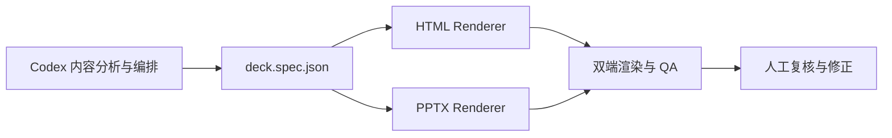

# 基于 Codex 的 PPT 双输出 MVP 方案

## 1. 方案结论

目标是同时得到：

- HTML/CSS/SVG 演示：适合网页展示、动画、交互和快速迭代。
- 原生可编辑 PPTX：文字、形状、表格、图表可以在 PowerPoint 中继续编辑。

推荐采用“一个结构化源文件，两个渲染器”的架构：



核心决策：

1. `deck.spec.json` 是唯一事实来源，不让 HTML 或 PPTX 代码各自维护一套内容。
2. PPTX 主链路使用本地 Presentations skill 规定的 `@oai/artifact-tool`。
3. PptxGenJS 作为成熟的原生 PPTX 备用渲染库，尤其负责图表、表格和兼容性补充。
4. HTML 使用普通 DOM/CSS/SVG，参考本地 `frontend-slides` skill 的演示控制器和无障碍规则。
5. `dom-to-pptx` 和 `html2pptx` 作为 HTML → PPTX 实验支线，不作为唯一生产底座。
6. 每次生成都要渲染截图并做溢出、重叠、换行和结构复核。

## 2. 调研结果如何转化为选型

| 方案 | 在 MVP 中的角色 | 选型判断 |
| --- | --- | --- |
| 本地 Presentations skill + `@oai/artifact-tool` | PPTX 主渲染器 | 最适合 Codex 本地开发；规则包含 native PPTX、布局、渲染和 QA |
| PptxGenJS | PPTX 备用/补充渲染器 | 成熟、MIT、支持文本、形状、图表、表格和 OOXML PPTX；适合做稳定底层能力。见 [PptxGenJS](https://github.com/gitbrent/PptxGenJS) |
| `frontend-slides` | HTML 演示实现参考 | 单 HTML、键盘/触摸/滚轮、动画和无障碍能力比较完整 |
| `dom-to-pptx` | HTML→可编辑 PPTX 实验 | 项目声称支持 DOM、字体、SVG 和可编辑 PPTX，但版本较新，需要用真实页面基准测试。见 [dom-to-pptx](https://github.com/atharva9167j/dom-to-pptx) |
| `html2pptx` | HTML→PPTX 备用实验 | 支持文本、图片、SVG、绝对定位和部分 Flexbox；适合受控 CSS 子集。见 [html2pptx](https://github.com/abdelkrimkr/html2pptx) |
| Presenton | 现成产品/模板参考 | 支持本地运行、Ollama、模板、API 和可编辑 PPTX；可作为对照实现，不作为本项目核心渲染器。见 [Presenton](https://github.com/presenton/presenton) |
| PPTAgent | Agent 流程参考 | 两阶段、编辑式生成，支持离线和 PPTX；但 Windows 需要 WSL。见 [PPTAgent](https://github.com/icip-cas/PPTAgent) |
| PPT Master | AI IDE skill 参考 | 关注原生形状、图表、动画和模板跟随，可参考其 Agent 工作流。见 [PPT Master](https://github.com/hugohe3/ppt-master) |
| PPTist | 后续网页编辑器参考 | Vue/TypeScript 的浏览器 PPT 编辑器，支持 PPTX 导入导出；AGPL-3.0，暂不作为 MVP 依赖。见 [PPTist](https://github.com/pipipi-pikachu/PPTist) |
| OPF | 中间格式设计参考 | AI-friendly JSON 格式很有价值，但目前处于 0.x，渲染和转换工具仍在规划。见 [Open Presentation Format](https://www.openpresentation.org/) |
| Slidev / Marp / reveal.js | HTML/Web 方案对照 | Slidev PPTX 默认是图片，Marp 的可编辑 PPTX 仍是实验性，reveal.js 主要是 HTML；不作为可编辑 PPTX 主链路。见 [Slidev Export](https://sli.dev/guide/exporting.html)、[Marp CLI](https://github.com/marp-team/marp-cli)、[reveal.js](https://revealjs.com/) |

## 3. MVP 的真实边界

### 3.1 MVP 必须完成

- 从 Markdown 或主题描述生成 3 到 5 页演示。
- 生成一份 `deck.spec.json`。
- 使用同一份 spec 生成 HTML 和 PPTX。
- HTML 支持基本导航和少量动画。
- PPTX 中的标题、正文、简单形状、表格和图表保持原生编辑能力。
- 同时生成 HTML/PPTX 截图用于对照。
- 自动检查 schema 错误、文本溢出、对象重叠和明显空白。

### 3.2 MVP 暂不完成

- 任意 HTML/CSS 完全无损转换为 PPTX。
- 复杂滤镜、`backdrop-filter`、`mix-blend-mode`、3D CSS、复杂动画转换为 PowerPoint 对象。
- 完整 PPTX 导入、反向编辑和模板母版解析。
- 多人协作、云端存储和 SaaS 发布。
- 原生 PowerPoint 动画与 HTML 动画完全一致。

## 4. 推荐的三层架构

### 4.1 结构与内容层

输入：主题、Markdown、PDF/DOCX/PPTX 文本、用户大纲。

输出：`deck.spec.json`，包含：

- 整体沟通任务和叙事弧线。
- 每页的 `slide_goal` 和 `primary_claim`。
- 页面类型：`title`、`pipeline`、`comparison`、`overview`。
- 元素：文本、图片、形状、图表、表格、连接线。
- 层级：`primary`、`secondary`、`tertiary`。
- 阅读顺序和分组关系。
- 可编辑性和渲染策略。

Codex 的生成顺序必须是：

```text
内容分析 → 叙事大纲 → 页面类型 → deck.spec.json → 渲染代码
```

不要让 Codex 直接从主题一次性生成 PPTX 代码。

### 4.2 视觉层

视觉层由 `theme.json` 和 `layouts/` 管理：

- 字体。
- 颜色。
- 页面尺寸。
- 网格和间距。
- 标题/正文层级。
- 图片裁切策略。
- 图表配色。
- HTML/PPTX 两端共享的 token。

视觉层可以改变颜色和坐标，但不能破坏 spec 中的阅读顺序、信息层级和分组关系。

### 4.3 渲染与 QA 层

两个独立 Renderer：

```text
deck.spec.json
  ├── render-html.mjs  → presentation.html
  └── render-pptx.mjs  → presentation.pptx
```

最后统一进入 QA：

```text
HTML 截图 + PPTX 渲染截图
        ↓
尺寸/溢出/重叠/换行/字体/结构检查
        ↓
修正 spec 或布局
```

## 5. `deck.spec.json` 设计

建议区分两个概念：

- `schemas/deck.schema.json`：JSON Schema，用于校验结构。
- `deck.spec.json`：某个具体 PPT 的内容和布局描述，是 Codex 的主要产物。

最小实例：

```json
{
  "spec_version": "0.1",
  "deck": {
    "title": "AI 自动化 PPT",
    "purpose": "explain",
    "audience": "technical_team",
    "language": "zh-CN",
    "aspect_ratio": "16:9"
  },
  "theme": "default",
  "narrative": {
    "arc": "problem -> approach -> result",
    "key_message": "同一份结构化内容可以同时产生网页演示和可编辑 PPTX"
  },
  "slides": [
    {
      "id": "s1",
      "layout": "title",
      "slide_goal": "establish_context",
      "primary_claim": "这是一个双输出 PPT 自动化系统",
      "elements": [
        {
          "id": "e1",
          "kind": "text",
          "role": "title",
          "text": "AI 自动化 PPT",
          "editable": true
        },
        {
          "id": "e2",
          "kind": "text",
          "role": "subtitle",
          "text": "HTML + 可编辑 PPTX",
          "editable": true
        }
      ],
      "review_flags": []
    }
  ]
}
```

### 5.1 元素类型

MVP 只支持以下元素：

| `kind` | HTML 实现 | PPTX 实现 | 可编辑性 |
| --- | --- | --- | --- |
| `text` | HTML 文本 | 原生文本框 | 高 |
| `shape` | CSS/SVG | 原生形状 | 高 |
| `image` | `` | 图片对象 | 图片本身可替换 |
| `chart` | SVG/Canvas | 原生图表或 SVG | 原生图表高；SVG 需转换 |
| `table` | HTML table | 原生表格 | 高 |
| `connector` | SVG line/path | 原生连接线 | 高 |
| `code` | `<pre>` | 文本框或图片 | 文本框高 |

### 5.2 `render_mode`

每个元素可以声明渲染策略：

```json
{
  "id": "hero-visual",
  "kind": "image",
  "render_mode": "asset",
  "editable": false
}
```

建议值：

- `native`：两端都尽量使用原生对象。
- `asset`：作为图片或 SVG 素材。
- `html_only`：只在 HTML 中出现，例如复杂交互。
- `pptx_only`：只在 PPTX 中出现，例如原生 PowerPoint 图表。

这样可以明确哪些内容必须可编辑，哪些内容允许只保留视觉效果。

## 6. MVP 具体组件

### 6.1 Codex 编排器

职责：

1. 解析输入材料。
2. 生成叙事大纲。
3. 选择页面类型。
4. 输出 `deck.spec.json`。
5. 根据 QA 报告进行修正。

建议使用三个独立 prompt/阶段：

```text
planner       → 叙事和页面大纲
schema-writer → 严格 JSON spec
reviewer      → 结构、视觉和导出问题检查
```

这比让一个 prompt 同时完成研究、排版、绘图和 QA 更容易控制。

### 6.2 HTML Renderer

推荐：原生 HTML/CSS/SVG，参考本地 [`frontend-slides` skill](<C:/Users/Wph/.codex/skills/frontend-slides/SKILL.md>)。

MVP 支持：

- 16:9 固定画布。
- `<section class="slide">` 页面模型。
- 键盘、滚轮、触摸和导航点。
- CSS reveal 动画。
- SVG 图表和连线。
- `prefers-reduced-motion`。
- 语义 HTML 和 ARIA 标签。

HTML 版本可以比 PPTX 更自由，但不应产生 PPTX 端无法解释的核心信息。

### 6.3 PPTX Renderer

主方案：本地 Presentations skill + `@oai/artifact-tool`。

约束：

- 使用 JavaScript ES modules。
- 不使用 `python-pptx` 作为主生成器。
- 文本、形状、表格、图表优先使用原生 PPTX 对象。
- 连接线先于节点创建，避免连线覆盖节点。
- 生成后逐页渲染检查。
- 必须修复意外重叠、文字裁切和溢出。

PptxGenJS 作为备用：

- 当 artifact-tool 对某类图表或表格支持不足时使用。
- 适合建立稳定的原生 PPTX 组件库。
- 不应与 HTML Renderer 共享大量布局细节；共享的是 spec 和 theme token。

### 6.4 HTML → PPTX 实验支线

使用 `dom-to-pptx` 或 `html2pptx` 做一个单独的 benchmark：

```text
同一 HTML 页面
  ├── 浏览器展示
  ├── dom-to-pptx 导出
  └── html2pptx 导出
```

只允许使用安全 CSS 子集：

- 固定尺寸。
- 绝对定位或简单 Flexbox/Grid。
- 文本、图片、边框、背景色、圆角。
- 简单旋转和 SVG。
- 简单阴影。

暂不依赖：

- `backdrop-filter`。
- `mix-blend-mode`。
- 复杂滤镜。
- 复杂响应式单位。
- 多层 CSS transform。
- 以 CSS 动画作为 PPTX 交付内容。

如果转换结果在 PowerPoint 中出现大量修复、字体错位或元素不可编辑，就退回双 Renderer 主方案。

## 7. 首批页面模板

### 模板 1：Title

- 标题。
- 一句话副标题。
- 一个主视觉或轻量背景。
- 不放复杂信息。

### 模板 2：Pipeline

- 左到右 3 到 5 个步骤。
- 原生连接线。
- 每步一个短标题和一句解释。
- 可选一个结果指标。

### 模板 3：Comparison

- 左右两列或上下两组。
- 统一比较维度。
- 重点差异用原生表格或图表表达。
- 不允许只靠颜色区分两组。

### 模板 4：Overview

作为第二阶段模板：

- 多区域组织。
- 阶段、层级或问题空间作为组织轴。
- 不直接做成大量卡片堆叠。

## 8. 项目目录

```text
PPT制作/
├── SKILL.md                         # 可选的结构规则来源
├── package.json
├── schemas/
│   └── deck.schema.json              # JSON Schema
├── examples/
│   └── demo.md                       # MVP 输入
├── src/
│   ├── cli.mjs
│   ├── planner.mjs
│   ├── schema-writer.mjs
│   ├── reviewer.mjs
│   ├── validate-spec.mjs
│   ├── render-html.mjs
│   ├── render-pptx.mjs
│   ├── render-pptx-pptxgenjs.mjs     # 可选备用
│   └── qa.mjs
├── layouts/
│   ├── title.mjs
│   ├── pipeline.mjs
│   └── comparison.mjs
├── themes/
│   └── default.json
└── dist/
```

建议的输出：

```text
dist/demo/
├── deck.spec.json
├── presentation.html
├── presentation.pptx
├── preview/
│   ├── html-001.png
│   ├── pptx-001.png
│   └── montage.png
└── qa/
    ├── report.json
    └── report.md
```

## 9. 运行命令

```powershell
node src/cli.mjs generate `
  --input examples/demo.md `
  --out dist/demo `
  --format both
```

辅助命令：

```text
node src/cli.mjs plan      --input examples/demo.md
node src/cli.mjs validate  --spec dist/demo/deck.spec.json
node src/cli.mjs render    --spec dist/demo/deck.spec.json --format both
node src/cli.mjs qa        --input dist/demo
```

## 10. 实施阶段

### MVP-0：不接 AI，先跑通双渲染

手写一份 `deck.spec.json`，完成：

- 3 个页面模板。
- HTML 输出。
- artifact-tool PPTX 输出。
- HTML/PPTX 截图。
- 基本 QA。

这是最重要的阶段。先证明双渲染架构可行，再接模型。

### MVP-1：接入 Codex 内容编排

让 Codex 按以下顺序工作：

1. 读取 Markdown 或用户主题。
2. 生成页面大纲。
3. 生成严格 JSON spec。
4. 调用两个 Renderer。
5. 读取 QA 报告。
6. 修改 spec 或布局。

### MVP-2：加入素材和模板

- 本地图片目录。
- SVG 图标。
- 主题 token。
- PPTX 模板跟随。
- 可选的图片生成工具。

### MVP-3：评估 HTML→PPTX

选 10 个真实页面做 benchmark，比较：

- 视觉相似度。
- 文本可编辑率。
- 图表可编辑率。
- 字体稳定性。
- PPTX 打开修复次数。
- QA 返工次数。

只有 benchmark 达标，才考虑把 `dom-to-pptx` 或 `html2pptx` 提升为正式路径。

## 11. QA 和验收标准

### 必须通过

- 同一份 `deck.spec.json` 生成 HTML 和 PPTX。
- HTML 在浏览器中可导航、可展示。
- PPTX 可以打开且不是整页图片。
- 标题、正文、形状、表格和图表至少有 80% 作为原生对象输出。
- 页面无明显文字裁切、溢出和意外换行。
- 无未处理的高严重度重叠。
- HTML 和 PPTX 页面顺序、标题和核心内容一致。
- QA 报告记录每个失败项和修正状态。

### 质量报告最小结构

```json
{
  "status": "pass | revise | reject",
  "outputs": {
    "html": "dist/demo/presentation.html",
    "pptx": "dist/demo/presentation.pptx"
  },
  "checks": {
    "schema": "pass",
    "html_render": "pass",
    "pptx_render": "pass",
    "overflow": "pass",
    "overlap": "pass",
    "editability": "manual_review"
  },
  "issues": []
}
```

### 当前环境前置条件

当前工作区已经有 Node、pnpm 和 Python；此前检查到 `soffice`、LibreOffice、Chrome、Edge 没有出现在当前 shell 的 PATH 中。因此在正式做渲染 QA 前，需要：

- 配置 Playwright 使用的浏览器。
- 安装或配置 LibreOffice/soffice 用于 PPTX 渲染。
- 记录字体依赖，避免不同机器上的换行差异。

## 12. 当前目录 `SKILL.md` 的最终定位

它不是这个 MVP 的主框架，也不是 PPTX 生成器；它是一个可插拔的结构审查模块：

```text
Codex planner
    ↓
通用 deck.spec.json
    ↓
SKILL.md 结构检查
    ↓
HTML Renderer / PPTX Renderer
```

优先复用它的规则：

- 唯一主旨。
- 清晰入口和阅读顺序。
- 一级/二级/三级层级。
- 分组不能只依赖颜色。
- 连接线一套样式对应一种语义。
- 文字角色和密度控制。
- `review_flags` 修正循环。

不直接复用或需要改写的部分：

- 期刊图尺寸约束。
- 纯科研图型分类。
- graphical abstract 的特定规范。
- 不能直接对应普通商业演示的字段。

## 13. 最终建议

第一版不要从 Presenton、PPTAgent 或 PPTist 改造开始，也不要先押注 HTML→PPTX 全自动转换。

建议的开发顺序是：

```text
1. 手写 deck.spec.json
2. 跑通 HTML Renderer
3. 跑通 artifact-tool PPTX Renderer
4. 做双端截图和 QA
5. 接入 Codex planner/schema-writer/reviewer
6. 再评估 dom-to-pptx/html2pptx
7. 最后考虑 Presenton/PPTAgent/PPTist 的能力集成
```

这样得到的 MVP 具有三个优点：

- 可以真正控制 PPTX 可编辑性。
- HTML 版本可以保留网页动画和交互。
- 后续可以替换渲染器，而不需要重写内容分析和页面结构。

